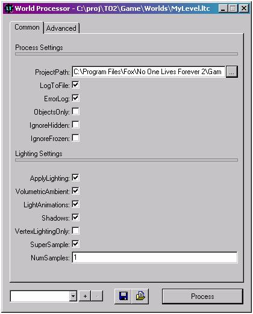
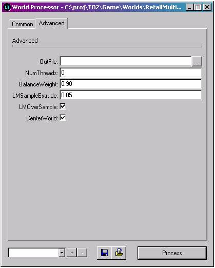
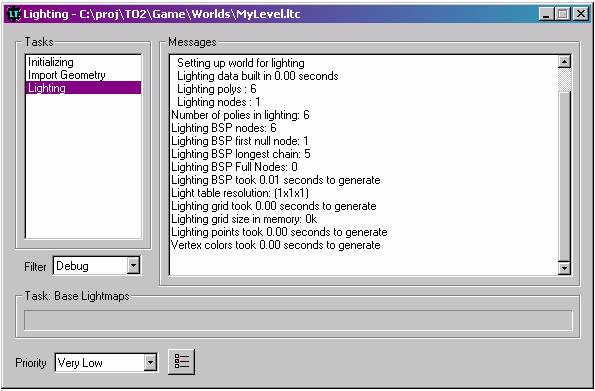

# Processing Levels

## Overview
### What is processing?
Processing is the term used for taking a level that you have created in DEdit and transforming it into a playable Nolf 2 map. Processing your level is a relatively simple and painless task, but doing it incorrectly can have highly adverse effects on both the look and performance of the game. 

### When should I process?
Processing takes place after you have created a level in DEdit. You must have at least one brush placed in your level before the processor will work. Similarly, you must have both a WorldProperties object  and a GameStartPoint object in your level before you can run it in the game. Each time you make a change to your level in DEdit, you must reprocess your level for the change to take effect. 

### How do I start the processor?
To start the processor, load your world in DEdit, and then select Process World from the World menu. 

### How can I run my level after it’s processed?
When the processor is finished, you can run your level directly from DEdit by selecting “Run” from the world menu. You must have DEdit properly configured to run files before this will work. See the DEdit tutorial document for more information on this topic. 

### What are .TBW Files?
When you save a world in DEdit, it is saved with the .TBW extension. These files are only readable by DEdit and cannot be run directly by the game. When you distribute your completed maps, you may choose to include this file so that others can further modify your work.

### What are .DAT Files?
Once your level has been processed, it will be saved with the same name as your .TBW file, but with the .DAT file extension. So if you built a level called MyLevel.TBW and compiled it, you would get MyLevel.DAT as a result. This is the file that you will need to include in your .rez files for distribution if you want other to be able to play your level. 

## Processor Options
The default settings for the processor (with the possible exception of the project path) are the settings that were used for the retail release of Nolf 2. These are the settings that you will want to use when you process your level for the final time prior to release. However, a full process on a large level using a slower machine can take up to an hour or more. During the course of development when you are likely to check your changes and additions often by actually playing the level, this can be a problem.

> The following sections will describe the various settings available in the processor application, and show you which options can be used to minimize the time it will take to covert your levels into playable maps. Options that are not specifically covered should be kept at their default values to avoid unexpected results. Note that any changes you make to any of these options will remain after you have closed the processor; so be careful to check your settings often. 

### Common Options
The processor application is running, the following dialog will appear on your screen:

#### Process Settings
**ProjectPath** - This is the path to the directory where your DEdit project file (.dep) is located. This must be set correctly or the processor will not be able to locate the resources needed to compile your level. 

**LogToFile** - This option will write out all of the text from the processor window to a log file, including error messages. The completed log files will be written out to the directory where processor.exe is located. The filename format for log files is:
`(level name)_(log file #).log`

**ErrorLog** - This option will write out any error messages that occur during the compilation processes to a separate log file for easy reference. The filename format for error log files is:
`(level name)Error_(log file #).log`

**ObjectsOnly** - One you have completed a full compile of your level and a .dat file already exists, you can use this option to do a quick, objects only compile of your level. This option will only process the objects in your level, leaving the existing geometry and lighting information contained within the .dat file intact. This option is intended to help you tweak your objects and then check them in the game without going through the hassle of a full install. Please note that you should always do a full compile before releasing any level to the public. 

**IgnoreHidden** - In large, complex levels, you may find that it’s easier to hide any nodes that you are not currently working on to increase performance and avoid mistakes. This option will determine whether or not the hidden pieces of your level should be processed. IgnoreFrozen:  Similar to IgnoreHidden, this option will determine if nodes you have set to frozen (i.e. not modifiable) will be processed. 

#### Lighting Settings
The following options are provided so that you can turn off lighting features to streamline compile time during development. However, you should always make sure to do a full compile with all lighting options set to their default settings before you distribute your level!

**Apply Lighting** - Unchecking this box will automatically disable all of the lighting options. If you have not made any lighting changes to your level since the last time it was processed, you can use this to significantly improve processing times. 

**Volumetric Ambient** - This determines if volumetric lighting should be calculated from the ambient setting on brushes. This is on by default. 

**LightAnimations** - This determines if lightmap animations should be created by the code and is on by default. 

**Shadows** - This determines if shadows will be generated from stationary objects in the level. This is also on by default. 

**Vertex Lighting Only** - For quick compiles, this option can be used to approximate lighting based on vertices. The results will not look as good as they would with a complete lighting pass. This is off by default. 

**SuperSample** - Specifies that lighting should be done by supersample, causing multiple samples to be taken per lightmap level. This is on by default. 

**Numsamples** - Specifies the number of samples that should be taken per lightmap texel. This defaults to 1.

### Advanced Settings
The options continued under the advanced settings tab were used in Nolf2 development and should never be changed. If you happen to change anything in this section accidentally, please refer to the image below for the default settings and change them back before processing your level to avoid potential problems with the game. 

 

## Finishing up
Once you actually run the Processor, the dialog will change to a log window and a display of progress bars showing compile progress. If you read the log window you can learn a lot about how the level is being handled. Error messages will also appear here. 

While your level is being processed, you may need to use your computer for other tasks. Use the priority option to determine how much of your system’s resources will be used to process your level. On the low and very low settings, the processor shouldn’t have too much of an impact on your other applications, but the tradeoff is that your level won’t be finished as quickly. 

Once the processor has finished, a bell will sound and a “close” button will appear at the bottom of the dialogue window. Click on this to close the processor. Your level is now ready to run. 