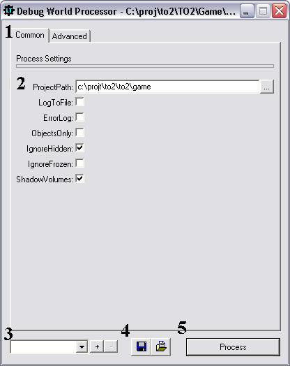
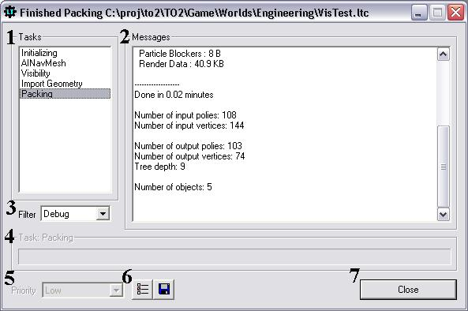

# WinPacker

## Overview
The purpose of this document is to describe the capabilities and command line options available for the WinPacker program. WinPacker serves as a front end user interface to a program called a packer. This packer serves the role of taking a resource file, such as a level, and performing any up front processing and conversion necessary for the resource to be able to be used by the engine at runtime.

## Packers
There are many instances of packers used by the engine, such as for models, worlds, and even effects. Currently only the world packing has been converted over to a module that is compatible with WinPacker, although more may be converted in the future. The benefit of breaking apart the packers into a module that communicates with WinPacker is that then all packers can have a single unified interface, and the feature set of WinPacker can be shared across all packers, providing a much more powerful interface than time would allow for developing with each packer. These compatible packers are stored in a DLL file, often in the Packers directory beneath where WinPacker is located.

## Opening WinPacker
When launching WinPacker, it must take a file to pack. In some cases this file may be provided already, such as when launching it through DEdit, or through another script that has provided the information. If the file is not provided, it will prompt the user for one using the standard file open dialog. Once a resource has been specified, WinPacker will determine the type of resource the file is, and attempt to find an appropriate Packer to convert the resource into an engine readable format. The rules for this packer finding are simple. It first checks under any user specified packer directory. This is discussed more in the command line portion. If none is specified, or no appropriate packer resides there, it will then check underneath the Packers directory in the same directory that WinPacker was located in. If this should fail, WinPacker will prompt the user to locate the directory where the appropriate packer resides, and will continue to do so until either a packer is found or the user cancels the packing operation.

## Property Dialog
Below is a screenshot of the property interface presented by WinPacker. This interface allows for the configuring of any and all properties that the packer needs. The packer is able to configure which properties are presented to the user, how they are grouped, and as the user changes parameters, handle validation of data and updating of any relevant properties, such as graying out properties that conflict with the current settings. After every time the packer is run, the last settings used will be saved so that they will be used as the default settings the next time that WinPacker is run with the same packer file. Therefore WinPacker will remember how you last ran a packing for a world file, and a model file, and any other resources supported. Each item of the property dialog will be described below.

### 1. The Property Panes
Each packer has the option to group the properties that it contains into different panes. These panes serve only to help categorize properties and make their use easier and more intuitive. The same property can be listed on multiple panes, and in such a case changing the value on one pane will also change the value on any other panes that it is listed on. There can only be one active pane at a time, and it is that active pane’s properties that will be shown in the property area (2). Clicking on the name of a different property pane will change to that pane and allow editing of its properties.

### 2. The Property Area
For the active property pane, the properties of that pane will be shown in this area. Different properties can have different types, such as numbers, or check boxes, or text that must be entered. The meaning of which can be determined by looking at the name of the property which is located on the left, and also by hovering the mouse over one of the property’s controls, such as a button or checkbox. After hovering for a second or two, a small text box will pop up with text describing what the purpose of this property is.

### 3. Preset Controls
In addition to WinPacker remembering the most recently used settings, it also allows for creation of custom presets that can be saved and loaded. These presets allow for a quick, easy, and less error prone way of performing different types of packing. Before a preset can be selected, it must first be created. This can by done by pressing the ‘+’ button. When this is pressed, it will prompt the user for a name. If a name is entered, it will create a new preset under that name that holds all the current properties. Therefore in the future, all the user needs to do is to click on the down arrow, select the preset of the name they entered and they will have the exact same settings as when they created the preset. In addition, after a preset has been selected, it can also be deleted by pressing the ‘-‘ button.

### 4. External Configuration Controls
These controls act very similar to presets, but it saves the preset out to a file on disk. These presets can then be later loaded, or used in automating the packing process. When pressing the disk icon, WinPacker will prompt the user for a file where the configuration will be stored. Once this is entered it will create a file that can be loaded at a later time to use the exact same configuration as was saved.

### 5. Process
Pressing this button will begin the packing process using the resource and properties specified. Once this button is pressed, the property dialog will disappear and will be replaced with the packing dialog that reports information about the packing process and is explained below.

## Packing Dialog
During the packing process, the packing dialog will be displayed. This allows the packer to communicate to the user what tasks it is performing, any issues that have arisen during packing, and also the overall progress of the packing process. This dialog does not require any user input, and is meant only to provide information to the user. Each component of the dialog will be described below.

### 1. Tasks
The packer has the option to break apart the packing process into smaller pieces called tasks. Each task is generally much more specific, and only one task can be active at a time. This active task is controlled by the packer, and is usually performed in a sequential manner, so it will perform a task, move onto the next task, and so on. Messages can also be reported by the packer, and as these messages are reported, they are associated with the currently active task. So for example, if the current task is “creating polygons” and the packer reports how long it took, this message will be associated with the “creating polygons” task. The user can change the task that they are viewing by selecting a task from this list. This will change the messages listed to those related to the selected task in the messages window (2). The current task being viewed is the task in the list with they grey background behind it.

### 2. Message Window
This window displays all messages associated with the task that the user is viewing. Each message can be color coded based upon its severity which is described more in item (6). The contents and meanings of these messages are dependant upon the packer that is being used to pack the current resource.

### 3. Message Filter
If there are too many messages in the window, or only severe messages want to be seen, this filter can be used to hide messages of lesser importance. Each message is associated with a severity. These are listed here in order of least severe to most severe: Debug, Verbose, Normal, Warning, High, and Critical. Therefore the user can set the filter at Normal and the message window (2) will only show messages of severity Normal or higher, and will not show any messages of severity Debug or Verbose. This can be a very useful tool for trying to find any issues that the packer might be reporting if a resource is not functioning properly.

### 4. Active Task Information
This area of the dialog shows the currently active task’s name as well as the progress. The name may not match exactly the tasks name, as each task can be broken apart into subtasks to provide better information to the user about what is precisely occurring and also aid in isolating areas of the packing process that are taking abnormally long periods of time.

### 5. Thread Priority
This control allows the changing of how important this processing is to the operating system. The higher this value is, the faster the process will go, but the less the user will be able to do while it is processing since it will be taking nearly all of the computer’s resources. It is generally best to leave this on low which allows for processes to occur in the background with minimal impact on the current task the user may be doing.

### 6. Color and Log Controls
These controls allow for two important operations to be done. The first button on the left allows for changing the color of the different message severities. This helps the user to quickly identify high severity errors from warnings or normal text. Pressing this button will bring up a dialog that allows assigning both a color and a prefix to each severity level. The prefix allows placement of user specified text in front of the message. This is often useful for scripting purposes, but otherwise generally should not be used. The other button next to the color settings button allows the saving of all the messages from the packing process to a specified text file. This is useful for when reporting issues to engineering.

### 7. OK
This button will close the dialog and is presented once the packing process is complete. If the packing process needs to be cancelled while it is still packing, the ‘X’ in the upper right hand corner of the dialog can be pressed. Doing so can cause issues with the resource, and it generally should not be used until after a different successful packing is completed.

## Command Line Parameters
One benefit of WinPacker is that in addition to the graphical user interface, it also allows for command line access to nearly all of its functionality. This allows for scripting and automation of the packing process, and this portion of the document is for users looking to setup situations like this.

The proper usage of WinPacker from the command line is:
`WinPacker [options]`  
Where `[options]` is one or more of the following command line options.

`-File <resource file>`
This option specifies the resource that should be packed by WinPacker. The filename can be either absolute or relative.

`-PackerDir <directory>`
This option indicates which directory should be checked in order to find a packer for the associated resource.

`-SkipPropDlg`
This option indicates that the property dialog should immediately be skipped, and processing should be done with the last used settings, and any settings specified through the command line.

`-NoPauseWhenDone`
This option indicates that the program should exit immediately after the packing process has completed. Therefore when packing is done, it will not wait for the user to press the OK button on the packing dialog and will immediately exit.

`-LoadOptions <options file>`
This option specifies a previously saved options file (see (4) on the property dialog section) that should be used for this packing process. Any properties listed in here will be used for this packing process.

`-<property> <value>`
In addition, any property that is listed on any of the property panes of the property dialog, can be specified directly on the command line. The command line is evaluated in a left to right order, so if a property is set to one value, and later set to another value, the second value will be used. The same applies to the loaded options. So for example a configuration can be loaded from disk, and then after that load options command is specified, a parameter can be set to a different value on the command line, thus overriding the value it obtained from the file.

Several command line examples are listed below:

This will specify a file to be packed, and will use the last settings, and immediately exit, which is useful for scripting the packing of a large number of resources.
`Winpacker -File SomeLevel.ltc -SkipPropDlg -NoPauseWhenDone`

This example will do the same as above, but use some settings that had been previously saved.
`Winpacker -File SomeLevel.ltc -SkipPropDlg -NoPauseWhenDone -LoadOptions Options.txt`

This version will do the as the above example, but override the value for the ProjectPath property.
`Winpacker -File SomeLevel.ltc -SkipPropDlg -NoPauseWhenDone -LoadOptions Options.txt -ProjectPath "c:\somedir"`

 