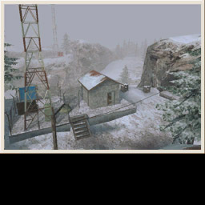

# Content Packs and Modifications
## Overview
This document will discuss how to create and distribute content packs, such as map packs, and modifications (mods) for the game No One Lives Forever 2. It will detail the directory structure of the game, how to gain access to the content shipped with the game, the directory structure of the Custom directory in the root folder of the game, and other important aspects of mod creation and distribution.

## Game Directory Structure
When setting up your content packs and mods it is important to use an exact replica of the directory structure used in NOLF2. If your files are in different directories the game will not be able to find them and no one will be able to play your maps. To view the correct directory structure of the game you should extract all the files from the Game.rez and Game2.rez files located in the root of your installed No One Lives Forever 2 directory. Extract each .rez file to the exact same folder (e.g. `game`). For more on `.rez` files and how to extract them see the LithRez and Rez files section below. As an example, if you are going to create a new map for the DoomsDay game type you would place your new map in a directory like this:

    MyMaps\Worlds\RetailMultiPlayer\DD_MyNewMap.dat

When you are finished with your map and ready to distribute it you would just need to create a `.rez` file from your MyMaps directory. (See below on how to create `.rez` files.)

## Custom Directory Structure
In your installed No One Lives Forever 2 directory there is a folder named Custom. Inside that folder are two other folders named Mods and Resources. In order for other people to properly play your new maps or mods they will need to be placed in these folders. The Resources folder is where all of the new content only .rez files, such as maps, should go. Any .rez file found in this folder will be automatically visible by the game. Any code changes, attribute file changes, changes to existing files, or changes to any of the retail maps in a .rez file within the Resources directory will be ignored by the game. The Resources folder is a place to put new content that isn’t necessary tied to a specific mod. If you wish to make any code or attribute file modifications you will need to place those .rez files within a separate folder inside the Mods folder. These files are only visible when the user selects your specific Mod to play. The Resources folder is always available regardless of the Mod selected. Each mod needs to be in its own folder within the Mods directory and the name of the folder needs to be the name of the mod. So when adding a new mod your `.rez` file(s) need to be in a directory that look like this:

    Custom\Mods\MyCoolMod

When zipping your files for download it would be wise to include a brief readme that instructs users on where to place the downloaded files. Creating a zip file or installer that automatically extracts the files to the proper folders would be ideal.

## LithRez and Rez files
Rez files contain all of the content, maps, models and textures that will be used by the game. The command line utility “LithRez.exe” is used to create .rez files, and also to unpack existing .rez files for modification.

When you installed the Nolf 2 tools, you were prompted to un-rez the Nolf 2 resources. If you chose yes at this prompt, then the installer called Lithrez.exe to unpack all of the Nolf 2 resources into a directory structure that can be recognized by DEdit and other tools. You can also unpack rez files manually from the command prompt by browsing to the Tools/Bin folder from the command prompt and typing the following:

    lithrez x RezFileName.rez TargetFolderName

The Nolf2 project `to2.dep` looks for resources in the Game subfolder of your main Nolf 2 installation directory. Therefore, files unpacked into any other folder will not show up in DEdit. Let say that for example, you downloaded a .rez file called `NewDMMaps.rez` from the Internet that included the source `.ltc` level files, and that you saved the file to `C:\Downloads`. To extract the resources into their proper Nolf2 folders (assuming that the .rez file was created correctly), you would browse to the `Tools/Bin` folder and type:

    lithrez x c:\Downloads\NewDMMaps.rez ..\..\Game

When creating map packs or modifications, you must first pack all of the new or modified resources into a .rez file. To do this, copy ONLY the new or modified files to a new directory structure that is a replica of the original NOLF 2 directory structure. Do not .rez the entire game folder itself, as this will include all of the original Nolf 2 resources in your .rez, making it much, much larger than it needs to be.

For example, let’s say that you have created a new deathmatch map that uses 2 new textures, and that the new textures are stored in the Game/Tex folder. Create a new folder named `C:\MyMaps`, and create the following Directory structure within:

    C:\MyMaps\Worlds\RetailMultiplayer
    C:\MyMaps\Tex\

When done, copy the .dat, (and the .cfg, and .dtx files if you have created them) for your map to the `RetailMultiPlayer` folder and the 2 textures to the `Tex` folder. You are now ready to create a `.rez` file. From the Tools/Bin folder, type:

    lithrez c MyMaps.rez C:\ MyMaps

 When the files are done packing, a file named `MyMaps.rez` will appear in the `Tools/Bin` folder, ready to be copied or archived as needed.

## Launcher and Dedicated Server
The source for the Launcher and Dedicated server are also provided for modification. The source is there in hope of people changing the look or making them easier to use and more robust. If you provide people with a new launcher or dedicated server it would be best if you named them separately from the retail versions or provide a means to copy the retail versions into a separate directory and then install the modified versions. If you fail to do this and overwrite the retail versions then users have no way to get the originals back if they decided they would rather use the ones provided. 

## Map Configuration Files
In order to specify a custom name or image for your multiplayer map, you will need to create a configuration file in the same directory as the map itself. The configuration file is simply a text file which contains information about a particular map. It’s name must match the map’s name, but with a .CFG extension. Thus, when loading this map:

    Worlds\RetailMultiPlayer\DD_MyNewMap.dat

The game will look for information about it in this file:

    Worlds\RetailMultiPlayer\DD_MyNewMap.cfg

A typical configuration file might be:

    [Mission]
    NameStr = "My New Map"
    Photo   = "Worlds\RetailMultiPlayer\DD_MyNewMap.dtx"

The first line, [Mission], is a header used by the game to identify the relevant data. NameStr specifies the name of the map as it will appear in the menus and on the load screen. Photo specifies the path to a texture which will be displayed while loading the map. The photo must be a texture (.dtx file) in order to work. You can convert TGA and PCX files to .dtx in DEdit like this:

1. Copy the file to a valid texture directory (i.e. game\tex)
2. With the Nolf2 project loaded, click on the Textures tab
3. Right-click anywhere in the lower pane
4. Select “Import TGA Files” (or PCX, etc.)
5. Browse to the folder that you copied the file to
6. Select the TGA file you want to import. .
7. Click “Open”.
8. Left click on the newly Imported tga file and select `texture properties` from the list.
9. Change the compression checkbox from 32-bit to S3TC DTX1 (8x compression)
10. Left click and select “Export as 8 bit dtx file”.

>Note that DEdit can only import images that have a resolution equal to or less than 256x256. Also, rectangular images can be used, but the bottom quarter of the image will be cropped as shown below:



## Creating Asset Lists
Asset lists contain the filenames of resources that are used by a level and it’s components during a game, but are not automatically loaded at the start of the level. When precaching is turned on in the options menu, Nolf2 will look for an assetlist for the level after it is loaded, and then precache all of the resources in the list. This greatly reduces hitching in the level. 

Before you can create asset lists, you will need to install the Perl programming language. You can download and install ActivePerl free of charge at http://www.activestate.com/Products/ActivePerl. Once this is installed, you can create asset lists like this:

1. In the Advanced Options menu in Nolf 2 launcher, type in the following on the command line:

        errorlog 1 alwaysflushlog 1 showfileaccess 1
2. Run the level you wish to build an asset list for. Make sure you do not use cheats and that you use everything available in the level (i.e., you listen to all conversations, activate every secret, use all available weapons/ammo types, set off any explosions, generate all debris available in the level, scroll through all HUD options, etc.)
3. When you feel confident that you have done everything possible within the level that would require an asset of some sort to be loaded dynamically, quit the game without loading any additional levels.
4. Rename the error`.log` file to the exact name of the level with a `.log` file extension (i.e. `mylevel.log`).
5. You will now need to manually edit the log file so that it only contains resources loaded after the level was completely loaded. Open the log file with a text editor and delete the following:

        All text prior to the line that reads something like: “Loaded world: Worlds\RetailSinglePlayer\mylevel in 3.87 seconds”
        Everything after the line that reads “World Ended”.
6. Save your changes and exit the text editor.
7. If for any reason you need to play through a level multiple times to ensure that all resources have been recorded, follow steps 1-6 again, making sure to rename each new log file appropriately. When done, you’ll need to create a single log file that combines the contents of all of the smaller files, and rename this to `mylevel.log`. You do not need to rearrange the contents of your log files in any particular manner, as all the matters is that the complete list of resources is contained in the file that you copy over in the next step.
8. Copy the edited log file to the `Tools\AssetLists\logs\new folder`.
9. Double click the `TO2\Development\Tools\AssetLists\BuildAssetLists.pl` script. When you run this script, the log file in the AssetLists\logs\new directory will be moved to the AssetLists\logs\processed directory and renamed based on the time/date. The log will then be processed and an intermediate file will be copied to `AssetLists\processing`. The final .txt version of the log fill will be copied to `AssetLists\final`.
10)   Copy the `AssetLists\Final\levelname.txt` file into the `Game\Worlds\` directory associated with the level that was logged. For example, if the level was `Game\Worlds\RetailMultiPlayer\dm_mylevel.dat`, you would copy the `AssetLists\Final\dm_mylevel.txt` file to the `Game\Worlds\RetailMultiPlayer` folder.
11)   Your asset list is now complete. The next time you run this level, all of the resources contained in the list will be precached before the level begins.

## Adding Strings
The text used by No One Lives Forever 2 is stored in string tables in CRes.dll. In order to add new strings, or modify existing string you will need to edit these string tables and rebuild the DLL in DevStudio. Existing strings will be found in the source code in either `game\clientres\to2\lang\en\clientres.rc` or in `game\clientres\shared\lang\en\clientresshared.rc`. New strings may be added to either resource file as long as the ids are unique across both files.

## Adding Cooperative Missions
In order to add Cooperative missions to No One Lives Forever 2, you must make a Mod rather then just a Content Pack. The list of Cooperative missions used by the game is stored in an attribute file:

    Attirbutes\CoopMissions.txt
Each individual Mission has an entry in this file, for example:

```
[Mission3]
//          Antarctica
NameId                         = 2519
DescId                          = 2768
ObjectiveIds       = "5001"
LayoutInfo                     = "LoadScreenC09x"
BriefingLayout    = "LoadScreenC09"
DefaultWeapons            = "Tazer,Beretta,Compact Codebreaker,Keychain"
DefaultAmmo                 = ""
DefaultMods                  = "Beretta Silencer"
Level0                           = "Worlds\RetailMultiplayer\CP_c04s01"
Level0BriefingId = 2719
```
 
**[Mission3]** is the header for the entry. These headers must be numbered sequentially.

**NameId** specifies the string id of the name of the mission. (See the Adding Strings section below for more details.)
**DescId** specifies the string id of a brief description of the mission.

**ObjectiveIds** is a comma separated list of string ids for the objectives given to the players at the start of the mission.

**LayoutInfo** and BriefingLayout specify the entries in Attributes\Layout.txt that determine the art used on the loading screen. If these are omitted, a default screen will be used.

**DefaultWeapons** is a comma separated list of the weapons given to each player at the start of the mission. The weapon names may be found in Attributes\Weapons.txt.

**DefaultAmmo** is a comma separated list of the ammunition types given to each player at the start of the mission. The ammo names may be found in Attributes\Weapons.txt. Each default weapon is given its default ammo automatically, so these do not have to be listed.

**DefaultMods** is a comma separated list of the weapon modifications (such as scopes and silencers) given to each player at the start of the mission. The mod names may be found in Attributes\Weapons.txt.

**Level0** is the path to the first level of the mission. A mission may have up to 10 levels. Level1 specifies the path to the second level; Level2 specifies the third, etc.

**LevelBriefingId0** is the string id for briefing text for the first level of the mission. If a level doesn’t require a briefing, then this entry may be omitted. A mission may have up to 10 levels. LevelBriefingId1 specifies the string id to the second level; LevelBriefingId2 specifies the third, etc.